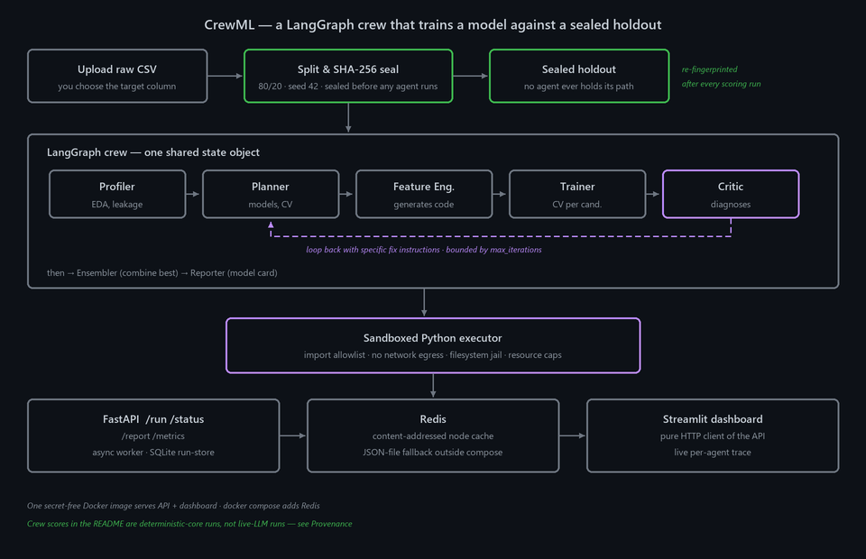

# CrewML

Give it a raw tabular dataset and a task, and a crew of specialised agents does the machine-learning work end to end: profiles the data, plans an approach, writes and runs feature-engineering code, trains candidate models, critiques the result, loops back if something is wrong, ensembles the winners, and writes a model card.

The part that makes it trustworthy is the evaluation protocol. Before any agent runs, the server splits the data and SHA-256-seals a holdout that no agent can reach — the crew's state object carries only a dataset id, never a file path. Every score below is measured on that sealed split, and the seal is re-fingerprinted after each scoring run.

---

## Architecture



---

## Measured results

Five OpenML datasets, seed 42, 20% holdout sealed before modelling. Higher is better.

| Dataset | Metric | Dummy (floor) | default RF | Solo agent | AutoML (FLAML) | **Crew** |
|---|---|---:|---:|---:|---:|---:|
| credit-g | ROC AUC | 0.5000 | 0.7783 | 0.6517 | 0.7352 | **0.7913** |
| diabetes | ROC AUC | 0.5000 | 0.8118 | 0.8147 | 0.8039 | **0.8150** |
| vehicle | macro-F1 | 0.1028 | 0.7260 | — crashed | 0.7785 | **0.8326** |
| cpu_small | R² | −0.0029 | 0.9726 | 0.7129 | **0.9759** | 0.9750 |
| kin8nm | R² | −0.0002 | 0.6948 | — crashed | **0.8421** | 0.8182 |

- **vs a one-shot solo agent — crew wins 3/3** where the solo agent produced a model at all; it crashed on the other two.
- **vs a default RandomForest — crew wins 5/5.**
- **vs classical AutoML — crew wins 3/5.** It loses cpu_small by 0.0009 and kin8nm by 0.0239. "Competitive with AutoML" is the accurate phrasing; "beats AutoML" would not be.

Source: [`results/comparison_table.md`](results/comparison_table.md) · [`results/dataset_manifest.json`](results/dataset_manifest.json)

> **Provenance — read this before quoting the crew column.** These crew scores come from archival runs executed during a Groq organization restriction (2026-07-20 → 07-22). A key was configured, so the run did not flag itself as mocked, but every live LLM call failed and the **deterministic core produced every score**. Read the crew column as deterministic-core results, not live-LLM results. The solo-agent column *was* a genuinely live run, so the two columns were not produced under equivalent LLM conditions.

### A live end-to-end run

The board above is deterministic-core. This one is not: a single unattended run
on an uploaded CSV, live LLM throughout, with the node cache cleared first so
every agent call had to reach the provider.

**Data.** 88,000 card transactions, 30 anonymised features, 152 fraud rows
(0.1727%) — a stratified sample of the public 284,807-row credit-card set at the
identical fraud rate, because the full 144 MB file is over the API's 50 MB upload
cap. Sealed at ingestion into 70,400 train / 17,600 holdout; the holdout carries
30 fraud rows.

| | ROC AUC |
|---|---:|
| Cross-validated on train (5-fold, stratified) | 0.9651 |
| **Sealed holdout, scored once** | **0.9336** |
| CV optimism | 0.0315 |

15 min 9 s wall clock · 6 live LLM calls · 0 cache hits · 7,472 tokens.

**What the crew decided without being told.** Flagged `class_imbalance`,
`target_leakage_suspected` and `duplicate_rows`; dropped `V4, V10, V12, V14, V17`
on leakage / integrity grounds; enabled `class_weight=balanced`; generated
feature code that failed validation on the first attempt and was self-repaired
before it ran (`log_Amount`, `Amount_to_Time`, `min_abs_V`, `V1_mul_V2`); and
refused its own ensemble, which scored 0.9589 against the best single model's
0.9651 on the same folds.

> **Read this before quoting 0.9336.** That holdout has now been scored by three
> independent crew runs — 0.9153, 0.9411 and 0.9336, mean 0.930, spread ±0.013.
> The variation is LLM non-determinism: each run wrote different feature code.
> With 30 positives in the holdout, ±0.013 is noise rather than improvement, so
> the honest single figure is the spread, not the best of the three. Accuracy is
> meaningless at this imbalance — predicting "never fraud" scores 0.99830.

Source: `results/demo_fraud_holdout.json` (local-only; the seal is re-fingerprinted
after scoring and verified intact).

### Does the Critic loop earn its keep?

The Critic is the differentiator, so it was ablated structurally — same seed, same settings, loop removed:

| Study | Datasets | Loop fired | Mean effect on holdout score |
|---|---|---|---|
| Natural (real data, no handicap) | 5 | **0/5** | **+0.0000** |
| Forced-deficiency probe (first pass crippled) | 2 | **2/2** | **+0.8894** (up to +0.9556) |

The honest reading: on clean data the loop never fires and costs nothing. When a pass is genuinely deficient, it is what recovers the score — without it the ablated variant shipped a near-stump (R² 0.0043 and 0.0193). It is a conditional safeguard, not a constant contributor.

Source: [`results/day13_critic_ablation.md`](results/day13_critic_ablation.md)

---

## How it works

1. **Ingest** — you upload a CSV and pick the target column; it is never guessed.
2. **Seal** — the server splits 80/20 and SHA-256-seals the holdout *before* the graph starts. `CrewState` carries a dataset id only.
3. **Profiler** — EDA and a leakage screen.
4. **Planner** — chooses candidate models, CV strategy and preprocessing.
5. **Feature Engineer** — generates feature code and runs it in the sandbox.
6. **Trainer** — cross-validates each candidate.
7. **Critic** — diagnoses overfitting, leakage, class imbalance and wrong-metric choices. If it finds a problem it loops back to the Planner or Feature Engineer with specific instructions, bounded by a `max_iterations` budget guard.
8. **Ensembler → Reporter** — combines the best candidates and writes a model card.
9. **Score** — only now is the sealed split unsealed, scored, and re-fingerprinted.

All generated code runs in a sandboxed executor: import allowlist, no network egress, filesystem jail and resource caps, tested adversarially.

## Infrastructure

| Layer | Technology |
|---|---|
| Agent graph | LangGraph |
| LLM | Groq (mock mode when no key is present) |
| Execution | Sandboxed Python executor |
| API | FastAPI — `/run` `/status` `/report` `/metrics`, async worker, SQLite run-store |
| Cache | Redis, content-addressed node cache (JSON-file fallback) |
| UI | Streamlit dashboard, a pure HTTP client of the API |
| Packaging | Single secret-free Docker image · docker compose |

---

## Quickstart

```bash
pip install -r requirements.txt
cp .env.example .env                 # add GROQ_API_KEY, or leave blank for mock mode
python scripts/prepare_datasets.py   # download + split + seal the 5 datasets
python -m pytest tests/
```

Run the service:

```bash
uvicorn crewml.api.app:app --port 8000       # the API
streamlit run crewml/dashboard/app.py        # the dashboard
```

or the whole stack:

```bash
docker compose up --build
```

Regenerate the architecture diagram with `python assets/make_architecture.py`.

---

## Deploy as a Hugging Face Space

`sdk: docker` — one container, API private on `:8000`, dashboard on the Space's `:7860`:

```bash
python scripts/deploy_hf_space.py --set-secret --wait 900
```

The script assembles the Space repo from [`deploy/hf_space/`](deploy/hf_space/), secret-scans the staging tree (key *values*, not names), uploads, and provisions `GROQ_API_KEY` as a Space **secret** — never into the image. With no secret the Space boots in clearly-labelled mock mode.

*Hosting new Docker Spaces on free hardware requires HF PRO, so the upload step is billing-gated on the target account.*

---

## License

Single-author project by Mark Rodrigues.
