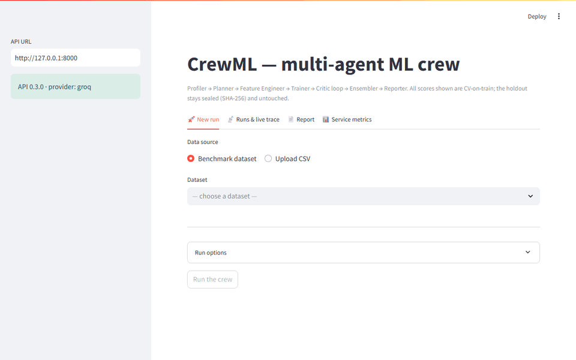
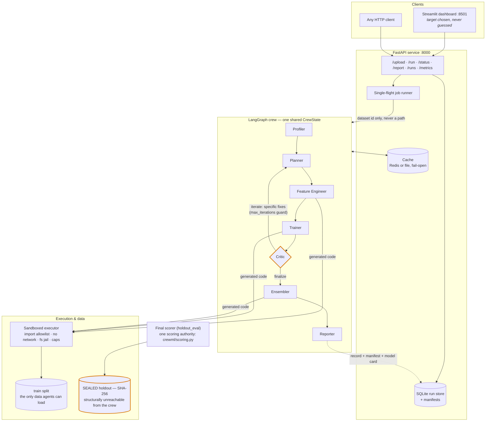

# CrewML

**An autonomous multi-agent ML engineering crew.** Give it a raw tabular dataset
and a task (classification or regression); a LangGraph crew of specialised agents
profiles the data, plans an approach, engineers features, trains and critiques
models in a loop, ensembles the best, and writes a model card — then proves its
worth against a solo agent, a default RandomForest and classical AutoML on a
SHA-256-sealed holdout it never sees.

> **The headline, measured on the locked holdout:** the crew beats the one-shot solo
> agent **3/3** where solo produced a model at all (it crashed on the other 2 of 5
> datasets — deltas up to **+0.26 R² / +0.14 ROC AUC**), beats a default
> RandomForest **5/5**, and beats FLAML on **3 of 5** — losing cpu_small by 0.001
> and kin8nm by 0.024. "Competitive with AutoML" is the honest phrasing;
> "beats AutoML" would not be. The crew column in these comparisons is the
> **deterministic core's** score, not a live-LLM run — see *Provenance* under
> Results.



*The demo above is a real, live-LLM run: a raw CSV is uploaded, the user
**chooses** the target column (never guessed), the server splits and SHA-256-seals
a holdout before any agent may run, and the crew is followed live to its report.*

## The crew

```
            ┌────────── specific fix instructions ──────────┐
            │                                               │ (iterate)
            ▼                                               │
Profiler → Planner → Feature Engineer → Trainer → Critic ───┘
  (EDA,     (models,   (generate + run    (CV per      │
  leakage   CV, prep)   FE code in the     candidate)  │ (finalize)
  screen)               sandbox)                       ▼
                                             Ensembler → Reporter
                                             (combine     (model
                                              best)        card)
```

Each node is a LangGraph agent sharing one state object. The **Critic** is the
differentiator: it diagnoses overfitting, leakage, class imbalance and
wrong-metric choices, then loops back to the Planner / Feature Engineer with
*specific* instructions — bounded by a `max_iterations` budget guard. All
generated code runs in a **sandboxed Python executor** (import allowlist, no
network egress, filesystem jail, resource caps — adversarially tested).

## System architecture



The two amber outlines are the honesty boundary: the **Critic loop** that has
to earn its keep (measured by ablation, Day 13), and the **sealed holdout** the
crew can never touch — `CrewState` carries only a dataset id, so no agent ever
holds a path to it; uploads get the same seal at ingestion, and
`verify_holdout_untouched` re-fingerprints the split after every scoring run.

## Results

All scores are on the LOCKED held-out split, higher is better. The crew never saw
this split while modeling; every split is SHA-256-sealed in
[`results/dataset_manifest.json`](results/dataset_manifest.json) and a test
proves the seal held. Full provenance:
[`results/comparison_table.md`](results/comparison_table.md) ·
[`results/phase3_results.md`](results/phase3_results.md).

| Dataset | Metric | Dummy (floor) | default RF | Solo agent (live) | AutoML (FLAML) | **Crew** |
|---|---|---|---|---|---|---|
| credit-g | ROC AUC | 0.5000 | 0.7783 | 0.6517 | 0.7352 | **0.7913** |
| diabetes | ROC AUC | 0.5000 | 0.8118 | 0.8147 | 0.8039 | **0.8150** |
| vehicle | macro-F1 | 0.1028 | 0.7260 | ✗ crash | 0.7785 | **0.8326** |
| cpu_small | R² | −0.0029 | 0.9726 | 0.7129 | **0.9759** | 0.9750 |
| kin8nm | R² | −0.0002 | 0.6948 | ✗ crash | **0.8421** | 0.8182 |

The solo agent (the same Llama-3.3-70B, one shot, no critique loop) is
*unreliable both ways*: it crashed outright on 2/5 datasets (a hallucinated
import, a timed-out grid) and where it ran it swung from best-on-board
(diabetes) to far behind a plain forest (cpu_small). That gap — correctness
*and* quality — is what the crew's Critic and self-repair loop exist to close.
The two crew losses are to AutoML and are reported as losses.

**Provenance.** The Crew column comes from the Day-12 archival runs, which
executed during a Groq organization restriction: a key was configured but every
live LLM call failed, so the **deterministic core** produced these scores. The
solo-agent column is a genuinely live Groq run (measured tokens, real
tracebacks) — the two columns were not run under equivalent LLM conditions. The
live-LLM crew arm was scored separately (Day 16) and does **not** reproduce the
Crew column within noise: credit-g −0.0016, vehicle +0.0113, cpu_small −0.0008,
kin8nm −0.0222, and diabetes failed outright live (the Day-20 self-repair
motivating case). Two margins above are also thinner than that live-vs-core
gap: crew−solo on diabetes (+0.0003) and crew−RF on cpu_small (+0.0023).
Compute footing: FLAML received 120 s *per dataset total* while the crew's
sandbox allows 120 s *per executed script* across multiple scripts per run — a
per-node, not system-level, parity.

### What each agent earns (ablations, Days 13–15)

Removing one agent at a time and re-scoring on the same sealed holdout (these
runs executed under the same provider restriction as the board above, so they
attribute score to the crew's *deterministic* Planner / Feature Engineer /
Critic implementations — not to live LLM narratives):

| Agent removed | Effect on held-out score |
|---|---|
| **Planner** | hurt on 5/5 datasets — mean −0.048, up to −0.125 (kin8nm) |
| **Feature Engineer** | hurt on 2/5, never helped — mean −0.004 |
| **Critic loop** | free when the first pass is healthy (fired 0/5, cost ±0.000); under a deliberately crippled first pass it fired 2/2 and recovered a mean **+0.89** of held-out score that the no-Critic crew shipped without |

The iteration-depth sweep (Day 15) shows the same shape: on healthy data extra
Critic budget changes nothing; under a forced deficiency the *first* allowed
loop buys the entire recovery. The production `max_iterations = 3` sits on the
safe plateau.

### Reliability & honesty (Phase 4)

- **Self-repair (Day 20):** when generated code crashes, the Trainer reads the
  traceback and fixes it — **18/18 injected faults recovered live**, all on the
  first attempt, zero false-positive "repairs" of clean runs.
- **Budgets (Day 21):** per-run token/time caps gate every LLM call; an
  exhausted budget degrades a run to its deterministic core — it never crashes
  it, and the score survived every tested cap.
- **Leakage & honesty guards (Day 22):** a calibrated single-feature screen at
  the Profiler, row-wise enforcement on generated FE code, and runtime
  no-peeking probes; all 16 checks hold.
- **Reproducibility (Day 23):** a per-run manifest pins seed / splits /
  versions / provider plus a result fingerprint; the deterministic core
  reproduces **bit-identically across fresh processes**, and live-LLM
  divergence is recorded and attributable rather than promised away.
- **Outage resilience:** with the LLM provider unreachable, all 5 datasets
  reproduce the archival held-out scores exactly (max |Δ| = 0.0) from the
  deterministic core — an outage costs narrative richness, never score. (The
  stronger *fingerprint-level* bit-identity claim above is measured on the two
  Day-23 study datasets, credit-g and cpu_small.)

### What it costs

Live crew runs on Groq Llama-3.3-70B: **under a cent per dataset** ($0.0067
measured across the live suite run — 4/5 datasets scored, diabetes failed live
and its tokens are still counted; tokens × published price, computed only from
tokens the accounting actually measured).

## Honest evaluation, in full

- 5 pinned OpenML datasets (2 binary, 1 multiclass, 2 regression).
- One seed-locked split into `train` (all the crew ever touches) and a
  **LOCKED holdout** used once for final scoring.
- One scoring authority: an AST-scan test asserts `crewml/scoring.py` is the
  only module importing `sklearn.metrics` and that every competing system calls
  it — the four systems are provably measured by the same ruler.
- Mock runs (no LLM key) exercise the pipeline but are banner-labelled and
  never reported as real numbers.
- Uploaded CSVs get the *same* guarantees at ingestion: the target column is
  **chosen, never guessed**; the server derives task/metric from the chosen
  column, splits, and seals the holdout before any agent can run.

## Production wrapper (Phase 5)

```
┌────────────┐  HTTP   ┌──────────────────┐        ┌────────────────┐
│ Streamlit  │ ──────▶ │ FastAPI          │ ─────▶ │ LangGraph crew │
│ dashboard  │         │ /run /status     │        │ + sandboxed    │
│ (pure HTTP │         │ /report /metrics │        │   executor     │
│  client)   │         │ SQLite run-store │        └────────────────┘
└────────────┘         └────────┬─────────┘
                                │ content-addressed node cache
                          ┌─────▼─────┐
                          │   Redis   │  (docker compose; JSON-file
                          └───────────┘   fallback outside it)
```

- **API** — submit a run, poll live progress (current node, per-agent trace,
  Critic decisions), fetch the report + manifest; async worker, SQLite
  run-store.
- **Caching + telemetry** — profiles and first-pass plans are
  content-addressed and memoised; every run records wall-clock, tokens,
  per-agent LLM seconds and cache events; `GET /metrics` aggregates the lot.
- **Docker** — one secret-free image serves both API and dashboard;
  `docker compose up` starts api + dashboard + redis.

## Quickstart

```bash
pip install -r requirements.txt
cp .env.example .env                 # add GROQ_API_KEY, or leave blank for mock mode
python scripts/prepare_datasets.py   # download + split + SHA-256-seal the 5 datasets
python -m pytest tests/              # the warranty: seals, sandbox, parity, API
```

Run the service:

```bash
uvicorn crewml.api.app:app --port 8000       # the API
streamlit run crewml/dashboard/app.py        # the dashboard (a pure API client)
```

or the whole stack:

```bash
docker compose up --build
```

Deploy it as a Hugging Face Space (sdk: docker — one container, API private
on :8000, dashboard on the Space's :7860, sealed benchmark splits baked in and
byte-verified against the committed manifest):

```bash
python scripts/deploy_hf_space.py --set-secret --wait 900
```

The script assembles the Space repo from [`deploy/hf_space/`](deploy/hf_space/),
secret-scans the staging tree (key *values*, not names), uploads, and
provisions `GROQ_API_KEY` as a Space **secret** — never into the image; with
no secret the Space boots in clearly-labelled mock mode. The exact image the
script ships is verified end-to-end in
[`results/day30_space_container_e2e.json`](results/day30_space_container_e2e.json).
*One caveat outside the repo's control: hosting new Docker Spaces on free
hardware now requires HF PRO, so the upload step is billing-gated on the
target account.*

## Status

Built in the open over 30 days. Every committed run leaves its numbers in
[`results/`](results/); every phase merged as a true-merge PR keeping its daily
commits.

- **Phase 1 — Foundation & Baselines** (Days 1–4) ✓ locked datasets, sealed
  holdout, Dummy / RF / solo / AutoML baselines
- **Phase 2 — MVP Crew** (Days 5–11) ✓ all seven nodes real, working Critic
  loop, end-to-end run → [model card](results/sample_model_card.md)
- **Phase 3 — Comparison Studies** (Days 12–18) ✓ crew vs solo vs AutoML vs
  default on the locked holdout; per-agent ablations, iteration-depth study,
  provider study, failure taxonomy
- **Phase 4 — Hardening & Safety** (Days 19–23) ✓ executor sandbox,
  self-repair, budgets, leakage guards, reproducibility
- **Phase 5 — Production Wrapper** (Days 24–27) ✓ FastAPI + run-store, cache +
  telemetry, Streamlit dashboard, Docker / compose
- **Phase 6 — Ship** (Days 28–30) ✓ test-suite warranty · README +
  [MODEL_CARD.md](MODEL_CARD.md) + demo · single-container Space image built,
  E2E-verified and ready to ship via `scripts/deploy_hf_space.py`

Project complete — 30 days, 6 phases, 6 true-merged PRs.

## License

Single-author project by Mark Rodrigues.
